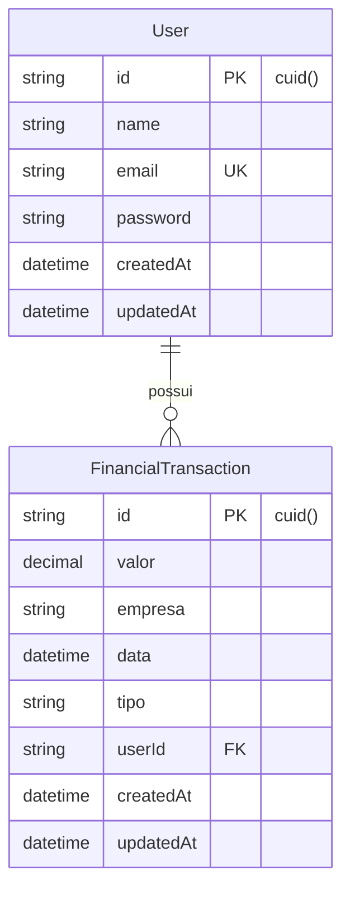
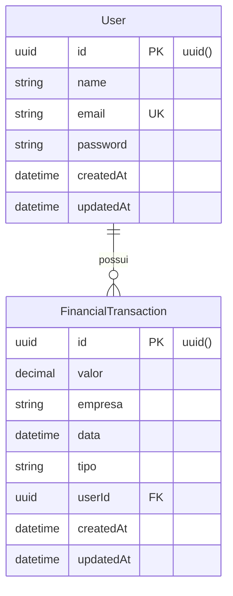
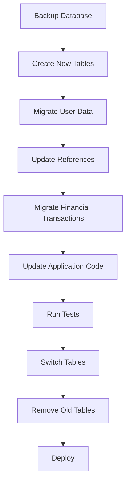

# Migração de IDs Genéricos para UUIDs no MyFinance

## Visão Geral

Este documento detalha o plano para migrar o sistema MyFinance de IDs genéricos (atualmente usando `cuid()`) para UUIDs (Universally Unique Identifiers) nativos. A migração visa melhorar a segurança, escalabilidade e interoperabilidade do sistema.

### Motivação

- **Segurança**: UUIDs são mais difíceis de predizer e enumerar
- **Escalabilidade**: UUIDs permitem geração distribuída sem conflitos
- **Padronização**: UUIDs são um padrão amplamente aceito
- **Interoperabilidade**: Facilita integração com outros sistemas

## Arquitetura Atual

### Modelos de Dados Atuais



### Stack Tecnológica

| Componente | Tecnologia | Versão |
|------------|------------|--------|
| ORM | Prisma | 6.16.1 |
| Database | PostgreSQL | - |
| Backend | Fastify + TypeScript | 5.6.0 |
| ID Generator | cuid() | Default |

## Arquitetura Proposta

### Novos Modelos com UUIDs



### Estratégia de Migração

#### Fase 1: Preparação do Schema

**Novo Schema Prisma:**
```prisma
model User {
  id                     String                 @id @default(uuid()) @db.Uuid
  name                   String?
  email                  String                 @unique
  password               String
  createdAt              DateTime               @default(now())
  updatedAt              DateTime               @updatedAt
  financialTransactions  FinancialTransaction[]
}

model FinancialTransaction {
  id        String   @id @default(uuid()) @db.Uuid
  valor     Decimal  @db.Decimal(15, 3)
  empresa   String
  data      DateTime
  tipo      String
  userId    String   @db.Uuid
  user      User     @relation(fields: [userId], references: [id], onDelete: Cascade)
  createdAt DateTime @default(now())
  updatedAt DateTime @updatedAt
}
```

#### Fase 2: Scripts de Migração

**Migração de Dados:**
```sql
-- Criar tabelas temporárias com UUIDs
CREATE TABLE "User_new" (
    "id" UUID NOT NULL DEFAULT gen_random_uuid(),
    "name" TEXT,
    "email" TEXT NOT NULL,
    "password" TEXT NOT NULL,
    "createdAt" TIMESTAMP(3) NOT NULL DEFAULT CURRENT_TIMESTAMP,
    "updatedAt" TIMESTAMP(3) NOT NULL,
    "old_id" TEXT NOT NULL,
    CONSTRAINT "User_new_pkey" PRIMARY KEY ("id")
);

CREATE TABLE "FinancialTransaction_new" (
    "id" UUID NOT NULL DEFAULT gen_random_uuid(),
    "valor" DECIMAL(15,3) NOT NULL,
    "empresa" TEXT NOT NULL,
    "data" TIMESTAMP(3) NOT NULL,
    "tipo" TEXT NOT NULL,
    "userId" UUID NOT NULL,
    "createdAt" TIMESTAMP(3) NOT NULL DEFAULT CURRENT_TIMESTAMP,
    "updatedAt" TIMESTAMP(3) NOT NULL,
    "old_id" TEXT NOT NULL,
    CONSTRAINT "FinancialTransaction_new_pkey" PRIMARY KEY ("id")
);
```

#### Fase 3: Migração de Controllers

**Adaptações nos Controllers:**

| Controller | Mudanças Necessárias |
|------------|---------------------|
| AuthController | Validação de UUID format nos parâmetros |
| FinancialTransactionController | Validação de UUID format em IDs |
| Middleware | Atualização de tipos JWT payload |

### Plano de Validação

#### Validação de UUID

```typescript
import { z } from 'zod';

const uuidSchema = z.string().uuid('Invalid UUID format');

// Schema para parâmetros
const idParamsSchema = z.object({
  id: uuidSchema
});
```

#### Middleware de Validação

```typescript
export const validateUUID = (paramName: string) => {
  return (request: FastifyRequest, reply: FastifyReply, done: () => void) => {
    const params = request.params as any;
    const id = params[paramName];
    
    if (!id || !isValidUUID(id)) {
      return reply.status(400).send({
        error: `Invalid ${paramName} format. Expected UUID.`
      });
    }
    
    done();
  };
};
```

## Fluxo de Migração



### Cronograma de Implementação

| Fase | Duração | Atividades |
|------|---------|------------|
| 1 | 1 dia | Preparação do schema e scripts |
| 2 | 1 dia | Migração de dados |
| 3 | 2 dias | Atualização dos controllers |
| 4 | 1 dia | Testes e validação |
| 5 | 1 dia | Deploy e monitoramento |

## Impacto na API

### Endpoints Afetados

| Endpoint | Mudança | Exemplo |
|----------|---------|---------|
| `GET /auth/me` | ID no response será UUID | `"id": "550e8400-e29b-41d4-a716-446655440000"` |
| `GET /financial-transactions/:id` | Parâmetro aceita UUID | `/financial-transactions/550e8400-e29b-41d4-a716-446655440000` |
| `PUT /financial-transactions/:id` | Parâmetro aceita UUID | `/financial-transactions/550e8400-e29b-41d4-a716-446655440000` |
| `DELETE /financial-transactions/:id` | Parâmetro aceita UUID | `/financial-transactions/550e8400-e29b-41d4-a716-446655440000` |

### Compatibilidade

**Breaking Changes:**
- Formato dos IDs nas responses mudará de `cuid` para `UUID`
- Validação mais rigorosa nos parâmetros de entrada
- Possível impacto em clientes que fazem parsing específico dos IDs

**Mitigação:**
- Documentação clara das mudanças
- Período de transição com logs de warning
- Versioning da API se necessário

## Validação e Testes

### Testes Unitários

```typescript
describe('UUID Validation', () => {
  test('should accept valid UUID', () => {
    const validUUID = '550e8400-e29b-41d4-a716-446655440000';
    expect(isValidUUID(validUUID)).toBe(true);
  });
  
  test('should reject invalid UUID', () => {
    const invalidUUID = 'cmfklpdba0000vplcz39cirs0';
    expect(isValidUUID(invalidUUID)).toBe(false);
  });
});
```

### Testes de Integração

| Cenário | Validação |
|---------|-----------|
| Criação de usuário | Novo usuário recebe UUID válido |
| Criação de transação | Transação vinculada com UUID correto |
| Busca por ID | Endpoint aceita e retorna UUID |
| Autenticação | JWT contém UUID válido |

### Checklist de Validação

- [ ] Schema Prisma atualizado
- [ ] Migrations executadas com sucesso
- [ ] Controllers validando UUIDs
- [ ] Testes unitários passando
- [ ] Testes de integração passando
- [ ] Performance mantida
- [ ] Logs de auditoria funcionando
- [ ] Backup de segurança criado

## Considerações de Segurança

### Benefícios

- **Não-sequencial**: Impossibilita enumeração de recursos
- **Criptograficamente seguro**: Geração baseada em random
- **Sem vazamento de informações**: Não revela timing ou volume

### Implementação Segura

```typescript
// Geração segura de UUIDs
import { randomUUID } from 'crypto';

export const generateSecureUUID = (): string => {
  return randomUUID();
};
```

## Monitoramento Pós-Deploy

### Métricas a Monitorar

| Métrica | Objetivo | Alerta |
|---------|----------|--------|
| Taxa de erro 400 | < 5% | > 10% |
| Tempo de resposta | < 200ms | > 500ms |
| UUID inválidos | 0 | > 0 |
| Performance DB | Baseline | +20% |

### Logs Importantes

```typescript
// Log estruturado para auditoria
logger.info('UUID migration completed', {
  oldFormat: 'cuid',
  newFormat: 'uuid',
  recordsMigrated: migrationStats.total,
  timestamp: new Date().toISOString()
});
```

## Rollback Strategy

### Plano de Contingência

1. **Rollback de Código**: Reverter para versão anterior
2. **Rollback de Dados**: Restaurar backup pré-migração
3. **Rollback de Schema**: Executar migrations reversas

### Critérios para Rollback

- Taxa de erro > 20%
- Performance degradação > 50%
- Falha crítica na autenticação
- Perda de dados detectada