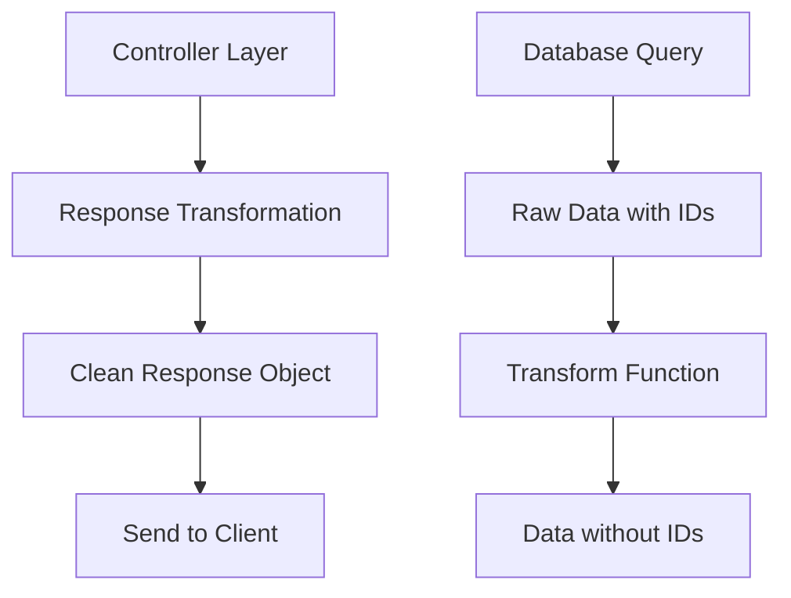

# Remoção de IDs das Respostas dos Endpoints

## Visão Geral

Esta funcionalidade visa melhorar a segurança da aplicação removendo a exposição de IDs internos do banco de dados nas respostas da API. A exposição de IDs pode revelar informações sobre a estrutura do banco de dados, volume de dados e permitir ataques de enumeração.

### Problema Identificado
- Todos os endpoints da aplicação expõem IDs internos (`id`, `userId`) nas respostas
- Endpoints de autenticação expõem IDs de usuário
- Endpoints de transações financeiras expõem tanto IDs de transação quanto IDs de usuário
- Esta prática representa um risco de segurança significativo

### Objetivo
Remover completamente a exposição de IDs internos mantendo a funcionalidade da aplicação intacta.

## Arquitetura

### Endpoints Afetados

#### Endpoints de Autenticação
- `POST /auth/register` - Remove `user.id` da resposta
- `POST /auth/login` - Remove `user.id` da resposta  
- `GET /auth/me` - Remove `user.id` da resposta

#### Endpoints de Transações Financeiras
- `POST /financial-transactions` - Remove `id` e `userId`
- `GET /financial-transactions` - Remove `id` e `userId` de cada transação
- `GET /financial-transactions/:id` - Remove `id` e `userId`
- `PUT /financial-transactions/:id` - Remove `id` e `userId`
- `PATCH /financial-transactions/:id` - Remove `id` e `userId`

#### Endpoints de Usuários
- `GET /users` - Remove `id` de todos os usuários
- `POST /users` - Remove `id` do usuário criado

### Estratégia de Implementação



### Transformações de Resposta

#### AuthController
```typescript
// Antes
{
  user: {
    id: "clxxxxx",
    name: "John Doe", 
    email: "john@example.com"
  }
}

// Depois
{
  user: {
    name: "John Doe",
    email: "john@example.com"
  }
}
```

#### FinancialTransactionController
```typescript
// Antes
{
  id: "cmfklpdba0000vplcz39cirs0",
  valor: 1500.5,
  empresa: "Banco do Brasil",
  userId: "clxxxxx",
  createdAt: "2025-09-15T04:05:24.259Z"
}

// Depois
{
  valor: 1500.5,
  empresa: "Banco do Brasil", 
  createdAt: "2025-09-15T04:05:24.259Z"
}
```

## Camada de Transformação de Dados

### Funções Utilitárias

#### `transformUserResponse(user)`
Remove campos sensíveis do objeto de usuário:
- Remove `id`
- Mantém `name`, `email`, `createdAt`, `updatedAt`

#### `transformTransactionResponse(transaction)`
Remove campos sensíveis do objeto de transação:
- Remove `id` e `userId`
- Mantém `valor`, `empresa`, `data`, `tipo`, `createdAt`, `updatedAt`

#### `transformTransactionListResponse(transactions)`
Aplica transformação em lista de transações:
- Itera sobre array de transações
- Aplica `transformTransactionResponse` em cada item

### Implementação de Controllers

#### AuthController Modificações

**register() method:**
```typescript
return reply.status(201).send({
  message: 'User created successfully',
  user: {
    name: user.name,
    email: user.email,
    createdAt: user.createdAt
  },
  token
});
```

**login() method:**
```typescript
return reply.send({
  message: 'Login successful',
  user: {
    name: user.name,
    email: user.email
  },
  token
});
```

**me() method:**
```typescript
return reply.send({
  user: {
    name: userData.name,
    email: userData.email,
    createdAt: userData.createdAt
  }
});
```

#### FinancialTransactionController Modificações

**create() method:**
```typescript
return reply.status(201).send({
  valor: decimalToNumber(transaction.valor),
  empresa: transaction.empresa,
  data: transaction.data,
  tipo: transaction.tipo,
  createdAt: transaction.createdAt,
  updatedAt: transaction.updatedAt
});
```

**list() method:**
```typescript
const formattedTransactions = transactions.map(transaction => ({
  valor: decimalToNumber(transaction.valor),
  empresa: transaction.empresa,
  data: transaction.data,
  tipo: transaction.tipo,
  createdAt: transaction.createdAt,
  updatedAt: transaction.updatedAt
}));
```

**getById() method:**
```typescript
return reply.send({
  valor: decimalToNumber(transaction.valor),
  empresa: transaction.empresa,
  data: transaction.data,
  tipo: transaction.tipo,
  createdAt: transaction.createdAt,
  updatedAt: transaction.updatedAt
});
```

**update() method:**
```typescript
return reply.send({
  valor: decimalToNumber(transaction.valor),
  empresa: transaction.empresa,
  data: transaction.data,
  tipo: transaction.tipo,
  createdAt: transaction.createdAt,
  updatedAt: transaction.updatedAt
});
```

#### UserRoutes Modificações

**GET /users:**
```typescript
const users = await prisma.user.findMany({
  select: {
    name: true,
    email: true,
    createdAt: true,
    updatedAt: true
  }
});
```

**POST /users:**
```typescript
const user = await prisma.user.create({
  data: {
    name,
    email,
    password: hashedPassword
  },
  select: {
    name: true,
    email: true,
    createdAt: true
  }
});
```

## Considerações de Segurança

### Benefícios da Implementação
1. **Prevenção de Enumeração**: Impede ataques que tentam enumerar recursos através de IDs sequenciais
2. **Redução de Surface Attack**: Diminui informações expostas sobre a estrutura interna
3. **Conformidade com Práticas de Segurança**: Alinha com princípios de menor exposição de dados

### Manutenção da Funcionalidade
- **Parâmetros de URL**: IDs continuam sendo aceitos nos parâmetros de URL para operações CRUD
- **Autenticação**: Sistema de autenticação permanece inalterado
- **Filtragem**: Funcionalidades de filtro e busca mantidas
- **Paginação**: Sistema de paginação não é afetado

### Impacto na Aplicação
- **Frontend**: Clients não podem mais depender de IDs nas respostas
- **Identificação de Recursos**: Deve usar outros meios para referenciar recursos
- **Cache**: Estratégias de cache podem precisar ser ajustadas

## Estrutura de Arquivos Modificados

```
src/
├── controllers/
│   ├── AuthController.ts           # Remove IDs das respostas de auth
│   └── FinancialTransactionController.ts  # Remove IDs das respostas
├── routes/
│   └── userRoutes.ts              # Remove IDs das respostas de usuário
└── models/
    └── ResponseTypes.ts           # (Opcional) Tipos para respostas sem ID
```

## Validação e Testes

### Cenários de Teste
1. **Registro de Usuário**: Verificar que resposta não contém `user.id`
2. **Login**: Confirmar ausência de `user.id` na resposta
3. **Criação de Transação**: Validar que `id` e `userId` foram removidos
4. **Listagem de Transações**: Verificar que nenhuma transação contém IDs
5. **Atualização de Transação**: Confirmar resposta sem IDs
6. **Busca de Transação**: Validar ausência de IDs na resposta individual

### Exemplos de Respostas Esperadas

#### POST /auth/register
```json
{
  "message": "User created successfully",
  "user": {
    "name": "John Doe",
    "email": "john@example.com",
    "createdAt": "2025-09-15T..."
  },
  "token": "eyJhbGciOiJIUzI1NiIs..."
}
```

#### GET /financial-transactions
```json
{
  "transactions": [
    {
      "valor": 1500.5,
      "empresa": "Banco do Brasil",
      "data": "2025-09-15T10:00:00.000Z",
      "tipo": "Receita",
      "createdAt": "2025-09-15T04:05:24.259Z",
      "updatedAt": "2025-09-15T04:05:24.259Z"
    }
  ],
  "pagination": {
    "page": 1,
    "limit": 10,
    "total": 2,
    "totalPages": 1
  }
}
```