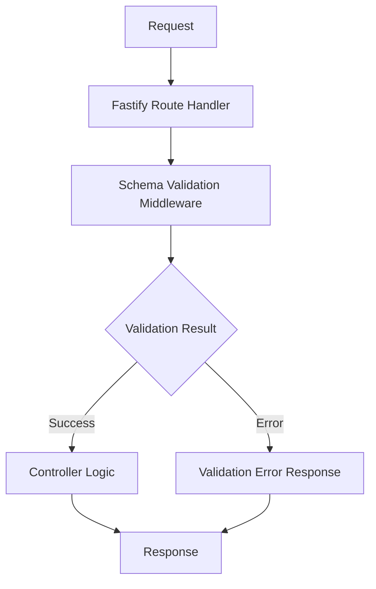
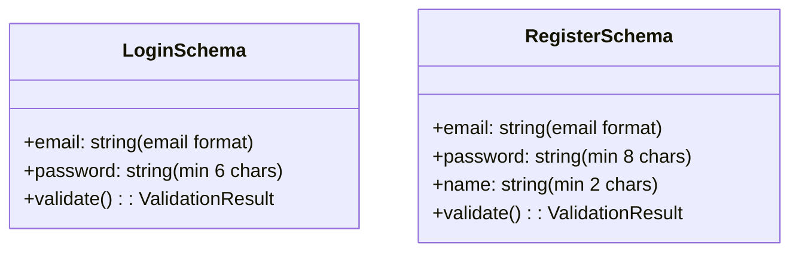
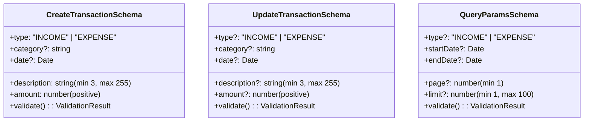
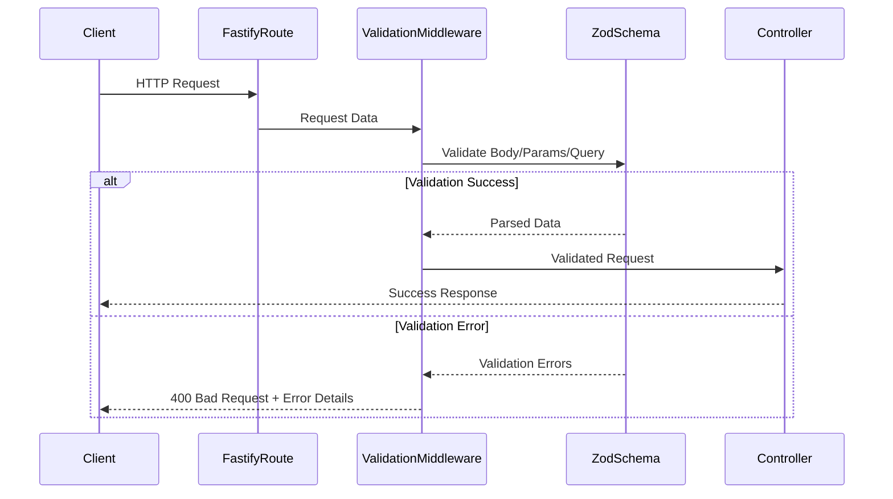
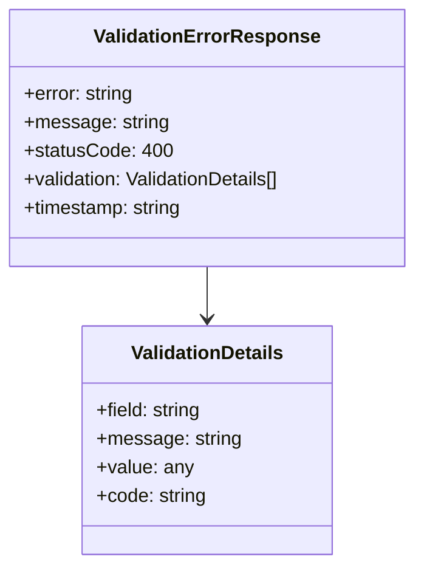
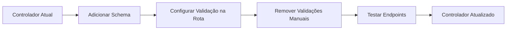
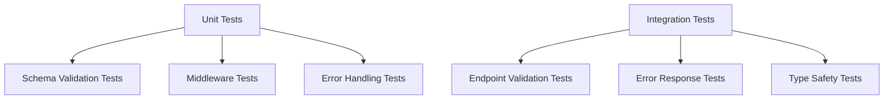

# Design: Validação de Tipos Rigorosa nos Controladores

## Overview

Implementação de validação de tipos mais rigorosa nos controladores da aplicação MyFinance para garantir integridade dos dados, melhor experiência do usuário e maior segurança. A solução utiliza o Zod (já presente no projeto) como biblioteca principal para validação de schemas, com integração nativa ao Fastify.

## Arquitetura

### Estrutura de Validação

### Componentes Principais

| Componente | Responsabilidade | Localização |
|------------|-----------------|-------------|
| **Request Schemas** | Definir estrutura esperada para body, params, query | `src/schemas/` |
| **Validation Middleware** | Aplicar validação automaticamente nas rotas | `src/middleware/` |
| **Error Handler** | Formatar erros de validação de forma consistente | `src/utils/` |
| **Type Definitions** | Tipos TypeScript derivados dos schemas | Gerados automaticamente |

## Schemas de Validação

### Schema para Autenticação

### Schema para Transações Financeiras

## Middleware de Validação

### Estrutura do Middleware

### Implementação com Fastify Prevalidation

| Hook | Propósito | Dados Validados |
|------|-----------|-----------------|
| `preValidation` | Validar antes do handler | Body, Params, Query |
| `preHandler` | Transformar dados validados | Aplicar transformações adicionais |
| `onError` | Capturar erros de validação | Formatar resposta de erro |

## Validações por Endpoint

### Endpoints de Autenticação

| Endpoint | Body Schema | Response Schema |
|----------|-------------|-----------------|
| `POST /auth/login` | LoginSchema | AuthResponseSchema |
| `POST /auth/register` | RegisterSchema | AuthResponseSchema |
| `GET /auth/me` | - | UserProfileSchema |

### Endpoints de Transações

| Endpoint | Params | Query | Body | Response |
|----------|--------|-------|------|----------|
| `POST /financial-transactions` | - | - | CreateTransactionSchema | TransactionResponseSchema |
| `GET /financial-transactions` | - | QueryParamsSchema | - | TransactionListSchema |
| `GET /financial-transactions/:id` | UUIDParamSchema | - | - | TransactionResponseSchema |
| `PUT /financial-transactions/:id` | UUIDParamSchema | - | UpdateTransactionSchema | TransactionResponseSchema |
| `PATCH /financial-transactions/:id` | UUIDParamSchema | - | PartialUpdateSchema | TransactionResponseSchema |
| `DELETE /financial-transactions/:id` | UUIDParamSchema | - | - | DeleteResponseSchema |

## Tratamento de Erros de Validação

### Formato Padrão de Erro

### Códigos de Erro Específicos

| Código | Descrição | Exemplo |
|--------|-----------|---------|
| `REQUIRED_FIELD` | Campo obrigatório ausente | email é obrigatório |
| `INVALID_FORMAT` | Formato inválido | email deve ter formato válido |
| `OUT_OF_RANGE` | Valor fora do intervalo | amount deve ser positivo |
| `INVALID_TYPE` | Tipo de dado incorreto | page deve ser número |
| `INVALID_UUID` | UUID malformado | ID deve ser UUID válido |

## Integração com Controladores Existentes

### Fluxo de Migração

### Controladores Afetados

| Controlador | Schemas Necessários | Prioridade |
|-------------|-------------------|------------|
| `AuthController` | Login, Register, Token | Alta |
| `FinancialTransactionController` | CRUD Transactions, Query Params | Alta |
| `UserController` | User Management | Média |

## Testing

### Estratégia de Testes

### Cenários de Teste

| Categoria | Cenários | Expectativas |
|-----------|----------|--------------|
| **Dados Válidos** | Requests com dados corretos | Processamento normal |
| **Dados Inválidos** | Campos ausentes, tipos incorretos | Erro 400 com detalhes |
| **Casos Extremos** | Valores limite, strings muito longas | Validação apropriada |
| **Tipos Aninhados** | Objetos complexos, arrays | Validação recursiva |

### Cobertura de Testes

- **Schemas**: 100% dos campos validados
- **Middlewares**: Todos os fluxos de sucesso e erro
- **Integração**: Todos os endpoints com dados válidos e inválidos
- **Performance**: Tempo de validação < 50ms para requests típicos