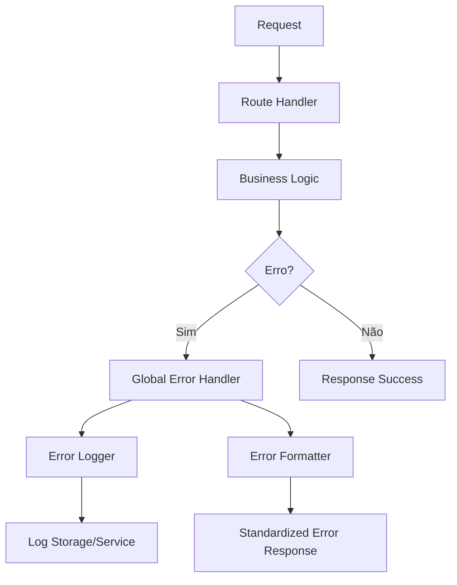
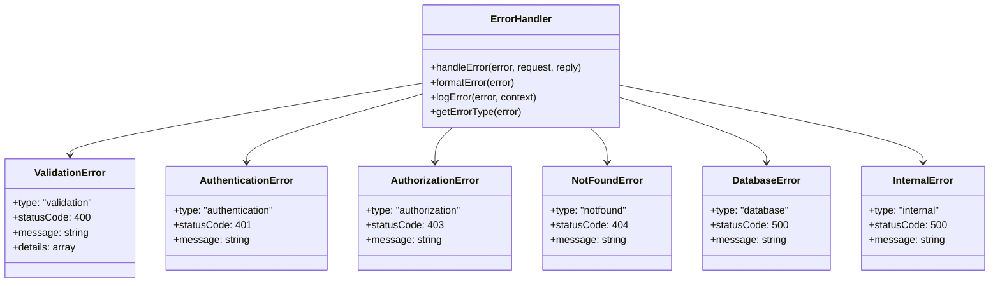
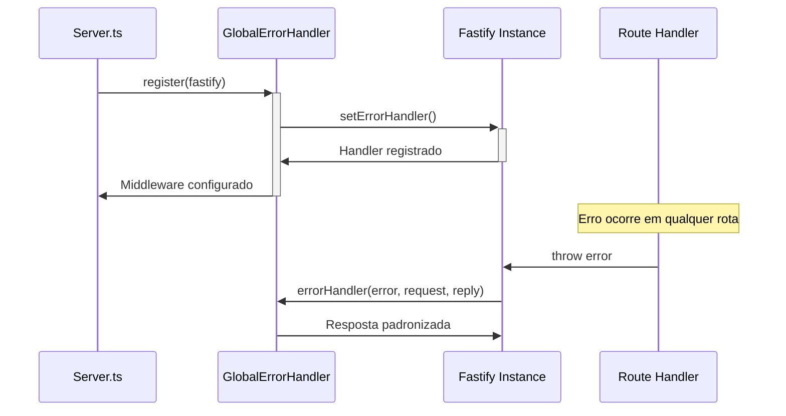

# Quest: Implementar Tratamento de Erros Global (Error Handler Middleware)

## Overview

Esta quest implementa um sistema de tratamento de erros global centralizado para a aplicação MyFinance, que atualmente utiliza Fastify como framework backend. O objetivo é substituir o tratamento de erros disperso pelos controladores por um middleware centralizado que padronize as respostas de erro, melhore o logging e facilite a manutenção.

## Problema Atual

### Cenário Existente
- Cada controlador possui seu próprio tratamento de erro
- Respostas de erro inconsistentes entre endpoints
- Logging de erros espalhado e não padronizado
- Dificuldade de manutenção e debugging
- Possível exposição de informações sensíveis em produção

### Exemplos de Problemas Identificados
```typescript
// Padrão atual inconsistente nos controladores
catch (error) {
  console.error('Auth middleware error:', error);
  return reply.status(500).send({
    error: 'Internal server error'
  });
}
```

## Arquitetura da Solução

### Componente Global Error Handler



### Hierarquia de Tratamento de Erros



## Estrutura de Implementação

### 1. Middleware de Error Handler

| Componente | Responsabilidade |
|------------|------------------|
| `globalErrorHandler.ts` | Middleware principal para captura e tratamento de erros |
| `errorTypes.ts` | Definição de tipos customizados de erro |
| `errorLogger.ts` | Sistema de logging estruturado para erros |
| `errorFormatter.ts` | Formatação padronizada de respostas de erro |

### 2. Tipos de Erro Suportados

| Tipo | Status Code | Descrição |
|------|-------------|-----------|
| ValidationError | 400 | Erros de validação de entrada (Zod) |
| AuthenticationError | 401 | Falhas de autenticação JWT |
| AuthorizationError | 403 | Acesso negado a recursos |
| NotFoundError | 404 | Recursos não encontrados |
| ConflictError | 409 | Conflitos de dados (ex: email duplicado) |
| DatabaseError | 500 | Erros de banco de dados Prisma |
| InternalError | 500 | Erros internos não categorizados |

### 3. Estrutura de Response Padronizada

```typescript
interface ErrorResponse {
  success: false;
  error: {
    type: string;
    message: string;
    code?: string;
    details?: any;
    timestamp: string;
    requestId: string;
  };
}
```

## API Reference

### Global Error Handler

```typescript
interface IGlobalErrorHandler {
  // Registra o handler no Fastify
  register(fastify: FastifyInstance): void;
  
  // Processa erro capturado
  handleError(
    error: Error,
    request: FastifyRequest,
    reply: FastifyReply
  ): Promise<void>;
  
  // Determina tipo do erro
  getErrorType(error: Error): ErrorType;
  
  // Formata resposta de erro
  formatErrorResponse(
    error: Error,
    type: ErrorType,
    requestId: string
  ): ErrorResponse;
}
```

### Error Logger

```typescript
interface IErrorLogger {
  // Log de erro com contexto
  logError(
    error: Error,
    context: LogContext,
    level: LogLevel
  ): void;
  
  // Contexto da requisição
  extractRequestContext(
    request: FastifyRequest
  ): RequestContext;
}
```

## Integração com Sistema Atual

### Modificações nos Controladores

**Antes (padrão atual):**
```typescript
try {
  // business logic
} catch (error) {
  console.error('Error:', error);
  return reply.status(500).send({ error: 'Internal server error' });
}
```

**Depois (com global handler):**
```typescript
try {
  // business logic
} catch (error) {
  throw error; // Deixa o global handler processar
}
```

### Integração no Server.ts



## Logging Estruturado

### Formato de Log

```typescript
interface ErrorLog {
  level: 'error' | 'warn' | 'fatal';
  timestamp: string;
  requestId: string;
  userId?: string;
  method: string;
  url: string;
  statusCode: number;
  errorType: string;
  errorMessage: string;
  stackTrace?: string;
  userAgent?: string;
  ip?: string;
  duration?: number;
}
```

### Níveis de Log por Tipo de Erro

| Tipo de Erro | Nível | Stack Trace | Notificação |
|--------------|-------|-------------|-------------|
| ValidationError | warn | Não | Não |
| AuthenticationError | warn | Não | Não |
| AuthorizationError | warn | Não | Sim (tentativas suspeitas) |
| NotFoundError | info | Não | Não |
| DatabaseError | error | Sim | Sim |
| InternalError | fatal | Sim | Sim |

## Configuração de Ambiente

### Variáveis de Ambiente

| Variável | Descrição | Padrão | Obrigatória |
|----------|-----------|---------|-------------|
| `ERROR_LOG_LEVEL` | Nível mínimo de log | `'error'` | Não |
| `INCLUDE_STACK_TRACE` | Incluir stack trace em produção | `false` | Não |
| `ERROR_LOG_FORMAT` | Formato do log (json/text) | `'json'` | Não |
| `ENABLE_ERROR_NOTIFICATIONS` | Habilitar notificações | `false` | Não |

## Tratamento Específico por Biblioteca

### Integração com Zod (Validação)

```typescript
// Detecção automática de ZodError
if (error instanceof ZodError) {
  return {
    type: 'validation',
    statusCode: 400,
    message: 'Dados de entrada inválidos',
    details: error.issues.map(issue => ({
      field: issue.path.join('.'),
      message: issue.message,
      code: issue.code
    }))
  };
}
```

### Integração com Prisma (Database)

```typescript
// Tratamento específico para erros Prisma
if (error.code === 'P2002') {
  return {
    type: 'conflict',
    statusCode: 409,
    message: 'Registro duplicado',
    details: { field: error.meta?.target }
  };
}
```

### Integração com JWT

```typescript
// Tratamento específico para erros JWT
if (error instanceof JsonWebTokenError) {
  return {
    type: 'authentication',
    statusCode: 401,
    message: 'Token inválido'
  };
}
```

## Request ID e Rastreabilidade

### Geração de Request ID


### Uso para Debugging

```typescript
// Cada log e response terá um requestId único
{
  "requestId": "550e8400-e29b-41d4-a716-446655440000",
  "error": {
    "type": "database",
    "message": "Falha na conexão com banco de dados"
  }
}
```

## Monitoramento e Alertas

### Métricas Coletadas

| Métrica | Descrição | Tipo |
|---------|-----------|------|
| `error_rate` | Taxa de erros por endpoint | Counter |
| `error_by_type` | Contagem por tipo de erro | Counter |
| `response_time_error` | Tempo de resposta em cenários de erro | Histogram |
| `critical_errors` | Erros críticos (500+) | Counter |

### Alertas Recomendados

- **Alta taxa de erros 500**: > 5% em 5 minutos
- **Erros de banco**: Qualquer erro de conexão
- **Tentativas de acesso suspeitas**: > 10 erros 401/403 do mesmo IP

## Testing

### Testes Unitários

```typescript
describe('GlobalErrorHandler', () => {
  test('deve formatar ZodError corretamente', async () => {
    // Testa formatação de erro de validação
  });
  
  test('deve logar erros críticos', async () => {
    // Testa logging de erros 500
  });
  
  test('deve gerar requestId único', async () => {
    // Testa geração de ID de requisição
  });
});
```

### Testes de Integração

```typescript
describe('Error Handler Integration', () => {
  test('deve capturar erro em endpoint POST /users', async () => {
    // Testa captura de erro em cenário real
  });
  
  test('deve retornar formato padronizado', async () => {
    // Testa estrutura de resposta
  });
});
```